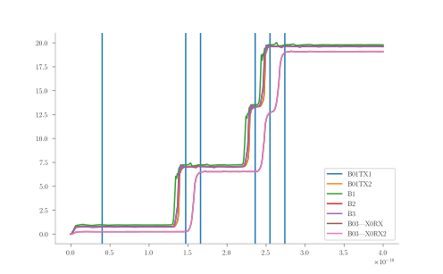

# Configuration File Format

The configuration is a [TOML file] with a specific table structure. The general
idea is that a mode, method or type is specified which dictates what should be
in the current table. Any unused tables or values are considered invalid.

## Modes

Currently the following modes are supported:

 * **[verify](#verify)** - Verify if a circuit works
 * **[yield](#yield)** - Perform a yield analysis on a circuit
 * **[margin](#margin)** - Perform a margin analysis on a circuit
 * **[optimize](#margin)** - Optimizate a circuit

Example:

```toml
mode = "verify"
```

### Verify

Does verification if a circuit works.

Consists of a single [verify table](#verify-table) that specifies how the circuit works

#### Verify Table

Currently the following method(s) are supported:

 * [spec](#specification-file-verification) - Verifies a circuit with a specification file

Currently only validation based on spec files are supported. The same
validation as done by [Mark Volkman's tools](#). More verification methods are
intended to be added to [josim-tools](index.md) in the future.

Example:

```toml
[verify]
method="spec"
```

#### Specification File Verification

The specification file verifier runs a simulation and checks the number of
times a junction has switched at certain time steps against the specification.

When this method is specified the following table entries are requires:

 * **file** - A string representing the path to the [specification
   file](#spec-file-format) which describes how the circuit should operate.
 * **circuit** - A string representing the path to the circuit testbench file.

When this method is specified the following table entries are optional:

 * **threshold** - A value specifying how close the phase jumps should be to
   \(2 \pi\) for it to be considered stable output. When not specified it
   defaults to \(0.05\) (\(5~\%\) of \(2\pi\)).

##### Spec file format

The specification starts with a line that describes the junctions that are
being checked. The format requires that the file start with `time` followed all
the junction names. Junctions can be in subcircuits and are referred to by the
appropriate trace name as output by JoSIM.

The following line is the calibration line. It is the time followed by the
initial switch counts.  It allows one to ignore the phase contribution from the
bias currents and set starting switch counts. The number of switches
specified must match the number of names specified in the name line.

The next line(s) is a variable number of data lines specifiying the time at
which switch counts must be valid. It starts with a single time value followed
by the required switch counts. The number of switches specified must match the
number of names specified in the name line.

```ANTLR
time: REAL;
switches: INTEGER;
name: STRING;

name_line: 'time' (WHITESPACE+ name)* WHITESPACE* NEWLINE;
calibration_line: time (WHITESPACE+ switches)* WHITESPACE* NEWLINE;
data_line: time (WHITESPACE+ switches)* WHITESPACE* NEWLINE;

file: name_line calibration_line data_line+;
```

Example configuration:

```toml
[verify]
method="spec"
circuit = "data/test_splitt_changed_sym.js"
spec_file = "data/test_splitt_changed_sym.sp"
```

Example spec file:

```
time        B01TX1      B01TX2      B1          B2          B3          B03|X0RX    B03|X0RX2
4.00E-011   0           0           0           0           0           0           0
1.47E-010   1           1           1           1           1           0           0
1.66E-010   1           1           1           1           1           1           1
2.36E-010   2           2           2           2           2           1           1
2.55E-010   3           3           3           3           3           2           2
2.74E-010   3           3           3           3           3           3           3
```

Example visualization:



### Margin

Does a margin analysis of a circuit.

Consists of a [verify table](#verify-table), a [margin table](#margin-table),
and a [margin parameters table](#margin-parameters-table) that specifies how the
margin analysis should be done.

#### Margin table

Specifies how a margin analysis should be done.

The following table entries are optional:

 * **max_search** - A number specifying the upper boundary of the margin
   analysis. When not specified it defaults to \(1.9\) (\(1 + 90~\%\)).
 * **min_search** - A number specifying the lower boundary of the margin
   analysis. When not specified it defaults to \(0.1\) (\(1 - 90~\%\)).
 * **scan_steps** - A positive integer specifying the number of scanning steps
   the margin analysis should take. When not specified it defaults to \(4\).
 * **binary_search_steps** - A positive integer specifying the number of binary
   search steps the margin analysis should do. When not specified defaults to
   \(3\).

#### Margin parameters table

A table specifying the parameters to do margin analysis on. Each entry in the
table is a [margin parameter table](#margin-parameter-table) whose key is the
name of the parameter.

#### Margin parameter table

A table specifying how a margin parameter should look

The following 

### Yield

Does a yield analysis of a circuit.

Consists of a [verify table](#verify-table), a [yield table](#margin-table),
and a [yield parameters table](#yield-parameters-table) that specifies how the
yield analysis should be done.

#### Yield table

Specifies how a yield analysis should be done.

The following table entries are required:

 * **num_samples** - A positive integer that specifies how many samples the
   yield analysis should do.

#### Yield parameters table

A table specifying the parameters to do yield analysis on. Each entry in the
table is a [yield parameter table](#yield-parameter-table) whose key is the
name of the parameter.

#### Yield parameter table

### Optimize

Optimizes the circuit paramters.

Consists of a [verify table](#verify-table), a [margin table](#margin-table),
an [optimize table](#optimize-table) and a [optimize parameters
table](#optimize-parameters-table) that specifies how the optimization should
performed.

#### Optimize table

#### Hybrid optimization

When this method is specified the following table entries are optional:

 * **search_radius** - How large area should be searched surrounding the
   current best guess for the next guess. If not specified it defaults to
   \(0.05\) (A \(5~\%\) wide square around the nominal values of the current
   best point). 
 * **converge** - How close the estimated guess score should be to the analysed
   guess score for converge. If not specified it defaults to \(0.01\)
   (\(1~\%\)).
 * **max_iterations** - A positive integer representing the maximum number of
   guesses the optimization routine will make before terminating due to maximum
   iteration count. If not specified it defaults to \(1000\).

#### Optimize parameters table

A table specifying the parameters to do optimization analysis on. Each entry in
the table is a [optimization parameter table](#optimize-parameter-table) whose
key is the name of the parameter.

#### Optimize parameter table

When this method is specified the following table entries are optional:

 * **search_radius** - How large area should be searched surrounding the
   current best guess for the next guess. If not specified it defaults to
   \(0.05\) (A \(5~\%\) wide square around the nominal values of the current
   best point). 
 * **converge** - How close the estimated guess score should be to the analysed
   guess score for converge. If not specified it defaults to \(0.01\)
   (\(1~\%\)).


[TOML file]: https://github.com/toml-lang/toml
